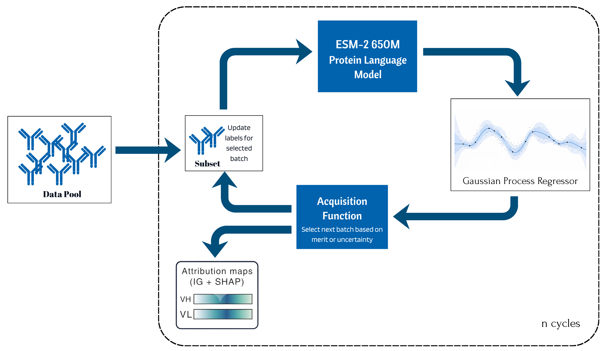

# Active Learning for Antibody Binding Affinity Prediction

Active Learning framework for Antibody Binding Affinity Prediction

[](https://www.python.org/)
[](https://pytorch.org/)
[](https://gpytorch.ai/)
[](LICENSE)

Antibody engineering campaigns must prioritise variants from large combinatorial libraries
under limited assay budgets. We present a Gaussian process (GP) active-learning benchmark
for antibody-antigen binding affinity prediction across eight public AbBiBench assays
spanning influenza hemagglutinin antibodies CR6261 and CR9114 and AAYL-series scFv
libraries against the SARS-CoV-2 Spike HR2 peptide. The framework embeds variable heavy
and light (VH/VL) sequences with ESM-2 650M, trains GP surrogates over compressed
protein-language-model representations, and evaluates kernel, acquisition, representation,
classical featurisation, and labelling-budget choices under a unified 10% experimental budget.
Across the benchmark, a Tanimoto-kernel GP with UCB acquisition is the strongest default,
achieving 67.3% mean Recall@2% across three random seeds, compared with 8.9% for
random selection. The same configuration recovers near-ceiling fractions of top binders
in the influenza libraries (89.5% on 3gbn h1, 95.5% on 3gbn h9, and 100% on 4fqi h3)
while exposing harder AAYL combinatorial landscapes where recall remains lower and
more variable. ESM-2 650M is the strongest representation (0.673 ± 0.28), outperforming
ProtBert, AntiBERTy, AbLang2, ProGen2, and classical encodings. On BindingGYM,
the same configuration matches or exceeds ALLM-Ab on three datasets using the 100-
sample held-out test metric. Structure-mapped Integrated Gradients and KernelSHAP
analyses recover CDR-region attribution patterns consistent with contact-derived paratope
geometry across deposited antibody-antigen complexes. These results support Tanimoto-
kernel GP active learning as a simple, reproducible strategy for label-efficient antibody
affinity optimisation with qualitative structural validation.



---

## Quick start (interactive demo)

```bash
conda env create -f environment.yml
conda activate al
jupyter lab notebooks/quickstart.ipynb
```

The notebook runs on the 3GBN H1 dataset using pre-computed embeddings — no GPU needed for the AL part. Per-residue Integrated Gradients and 3D structure mapping are included.

---

## Repository structure

```
antibody_al/               Python package — importable GP + AL core
├── core.py                GP model, Tanimoto/RQ/Matern/RBF kernels, UCB/EI/PI acquisition
├── featuriser.py          ESM-2 650M sequence embedding (VH+G+VL concatenation)
├── gp_model.py            ExactGP class definition
├── acquisition.py         Acquisition function helpers
├── active_learning.py     AL loop utilities
└── utils.py               Helper functions

scripts/                   Experiment scripts (numbered = paper benchmark pipeline)
├── 01_run_main.py         Main benchmark: 384 runs (4 kernels × 4 protocols × 8 datasets × 3 seeds)
├── 02_run_plm.py          PLM ablation: 144 runs (6 PLMs × 8 datasets × 3 seeds)
├── 03_run_aa_rep.py       AA representation ablation: 72 runs
├── 04_compile.py          Compile per-run CSVs → results_final/compiled/ summaries
├── 05_figures.py          Generate all paper figures from compiled summaries
├── compute_embeddings.py              ESM-2 650M embeddings for all 8 AbBiBench datasets
├── compute_embeddings_plm_comparison.py   ProtBert, AntiBERTy, AbLang2, ProGen2
├── compute_classical_featurizations.py    Bag-of-AA, BLOSUM62, one-hot encodings
├── compute_embeddings_bindinggym.py   ESM-2 embeddings for BindingGYM datasets
├── preprocess_data.py                 Standardise raw AbBiBench CSVs
├── preprocess_bindinggym.py           Standardise BindingGYM CSVs
├── run_bindinggym_al.py               BindingGYM comparison (ALLM-Ab protocol)
├── run_epistasis_analysis.py          Landscape epistasis: lin-R², r_nn per dataset
├── run_pdb_explainability.py          IG + KernelSHAP with PDB structure mapping
└── extract_ground_truth_contacts.py   Heavy-atom paratope contacts from PDB files

notebooks/
└── quickstart.ipynb       Interactive demo: CSV upload → AL cycles → IG heatmap → 3D structure

configs/
└── dataset_configs.yaml   Dataset metadata (N, seed/batch sizes, top-2% thresholds)

figures/
├── al_architecture.pdf    AL workflow architecture diagram (paper Figure 1)
└── al_workflow.png        AL workflow overview

data/                      Generated by scripts; not committed (embeddings are large)
├── sample_3gbn_h1.csv     300-variant demo subset for quickstart notebook
└── pdb/3GBN.pdb           CR6261/H1N1-HA crystal structure for 3D attribution demo

results_final/
└── compiled/              Pre-compiled summary CSVs (committed for reference)
    ├── main_summary.csv   384-run benchmark results
    ├── plm_summary.csv    PLM ablation results
    ├── aa_rep_summary.csv AA representation ablation results
    └── budget_curves.csv  Per-cycle learning curves

environment.yml            Conda environment specification (Python 3.10, PyTorch 2.11, GPyTorch 1.15)
requirements.txt           Pinned pip requirements matching paper experiments
setup.py                   Package installation (pip install -e .)
```

---

## Reproduce paper results

### 1. Install

```bash
conda env create -f environment.yml
conda activate al
pip install -e .
```

### 2. Prepare data

Download AbBiBench datasets from [Zhao et al., 2025](https://arxiv.org/abs/2506.04235) → `data/raw/`

```bash
python scripts/preprocess_data.py
python scripts/compute_embeddings.py          # ESM-2 650M  (~2 h GPU)
python scripts/compute_embeddings_plm_comparison.py   # ProtBert, AntiBERTy, AbLang2, ProGen2
python scripts/compute_classical_featurizations.py    # Bag-of-AA, BLOSUM62, One-hot
```

### 3. Run benchmark

```bash
python scripts/01_run_main.py    # 384 runs — ~8 h on RTX A4000
python scripts/02_run_plm.py     # 144 runs — ~4 h
python scripts/03_run_aa_rep.py  # 72 runs  — ~1 h
python scripts/04_compile.py     # aggregate → results_final/compiled/
python scripts/05_figures.py     # generate paper figures
```

### 4. BindingGYM comparison (Section 4.2)

```bash
python scripts/preprocess_bindinggym.py
python scripts/compute_embeddings_bindinggym.py
python scripts/run_bindinggym_al.py
```

### 5. Epistasis analysis (Section 4.4)

```bash
python scripts/run_epistasis_analysis.py
```


## Software and hardware

All experiments were run on **Python 3.10 | PyTorch 2.11.0+cu128 | GPyTorch 1.15.2 | NVIDIA RTX A4000 (16 GB VRAM)**.  
See `requirements.txt` for the complete pinned dependency list used in the paper.

| Step | Runtime |
|---|---|
| ESM-2 embeddings (8 datasets) | ~2 h |
| Main benchmark (384 runs) | ~8 h |
| PLM ablation (144 runs) | ~4 h |
| AA rep ablation (72 runs) | ~1 h |
| Epistasis analysis | ~5 min |

---


## License

MIT — see [LICENSE](LICENSE).
